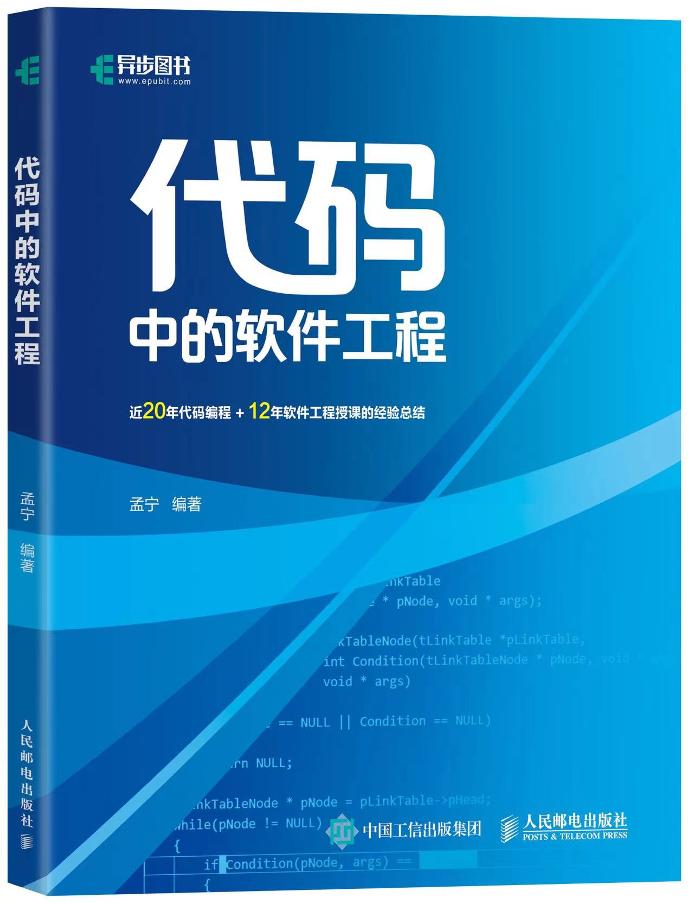

# 软件工程

《[代码中的软件工程](https://j.youzan.com/awNT6e)》一书的配套教学资料

#### 介绍
[软件工程 —— 码农的自我修养](ppt/软件工程-码农的自我修养.pptx)

#### 工欲善其事必先利其器

* [工欲善其事必先利其器.pptx](ppt/工欲善其事必先利其器.pptx)

* 1.编程神器 Visual Studio Code
* 2.五大场景玩转 Git
* 3.正则表达式十步通关

#### 代码中的软件工程

* [工程化编程实战——代码中的软件工程.pptx](ppt/工程化编程实战——代码中的软件工程.pptx)
* [menu实验代码](src), [menu实验代码打包下载](ppt/menu_code.zip)
* https://github.com/mengning/menu
* 4.简约而不简单——代码规范和代码风格
* 5.模块化软件设计
* 6.可重用软件设计
* 7.可重入函数与线程安全
* 8.工程化编程实战总结

#### 从分析到设计的基本方法

* [从需求分析到软件设计.pptx](https://gitee.com/mengning997/se/raw/master/ppt/%E4%BB%8E%E9%9C%80%E6%B1%82%E5%88%86%E6%9E%90%E5%88%B0%E8%BD%AF%E4%BB%B6%E8%AE%BE%E8%AE%A1.pptx)
* 9.获取需求的主要方法
* 10.对需求进行分析和建模
* 11.从需求分析到软件设计

#### 软件科学基础概论

* [软件科学基础概论.pptx](https://gitee.com/mengning997/se/raw/master/ppt/%E8%BD%AF%E4%BB%B6%E7%A7%91%E5%AD%A6%E5%9F%BA%E7%A1%80%E6%A6%82%E8%AE%BA.pptx)
* 12.软件是什么？
* 13.软件设计模式初步
* 14.常见的软件架构举例
* 15.软件架构风格与描述方法
* 16.什么是高质量软件？

#### 软件危机的前生后世

* [软件危机和软件过程.pptx](ppt/软件危机和软件过程.pptx)
* 17.软件危机
* 18.软件过程模型
* 19.PSP和TSP
* 20.CMM/CMMI
* 21.敏捷方法
* 22.DevOps

